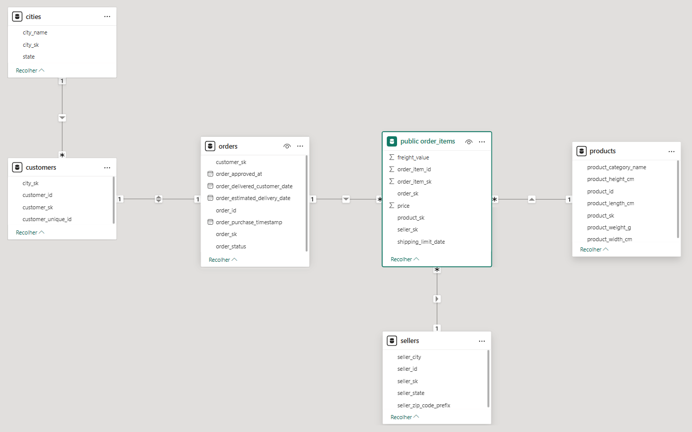
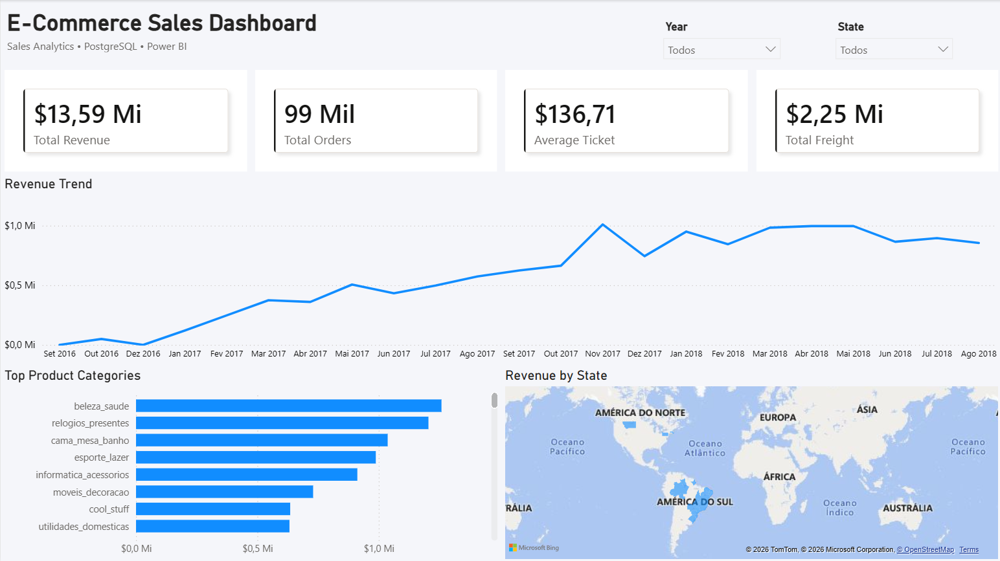

# Ecommerce Data Pipeline & Sales Analytics

End-to-end data engineering and business intelligence project built using the Brazilian Olist e-commerce dataset.

This project simulates a real-world analytical workflow involving ETL processes, dimensional modeling, PostgreSQL data warehousing, and interactive dashboard development with Power BI.

---

## Technologies

* Python (pandas)
* PostgreSQL
* SQL
* SQLAlchemy
* Power BI
* DAX
* Git / GitHub

---

## Project Overview

The project was designed to transform raw e-commerce transactional data into an analytics-ready environment for business intelligence and executive reporting.

Main objectives include:

* Building ETL pipelines using Python
* Creating dimensional data models
* Generating surrogate keys
* Validating data quality and relationships
* Loading analytical datasets into PostgreSQL
* Developing interactive Power BI dashboards
* Creating KPIs and business metrics

---

## Data Pipeline Workflow

```text
Raw CSV Files
      ↓
Python Transformation Layer
      ↓
Data Cleaning & Validation
      ↓
Dimensional Modeling
      ↓
PostgreSQL Data Warehouse
      ↓
Power BI Analytics Dashboard
```

---

## Dimensional Model

### Dimensions

#### Cities

* Unique city and state records
* Surrogate key (`city_sk`)

#### Customers

* Customer identifiers
* Geographic relationships via `city_sk`

#### Products

* Product categories and attributes
* Product dimensions and weight metrics

#### Sellers

* Seller geographic information
* Seller city and state relationships

#### Orders

* Order status and purchase timestamps
* Customer relationships

---

### Fact Table

#### Order Items

Central fact table containing transactional sales data.

Metrics include:

* Product price
* Freight value

Relationships:

* Orders
* Products
* Sellers

---

## Database Schema



---

## Executive Sales Dashboard

Interactive Power BI dashboard focused on business performance analysis and KPI monitoring.

### Dashboard Features

* Revenue trend analysis
* Regional sales analysis
* Product category performance
* Interactive filtering
* KPI monitoring
* Freight analysis

### KPIs

* Total Revenue
* Total Orders
* Average Ticket
* Total Freight

---

## Dashboard Preview



---

## DAX Measures

### Total Revenue

```DAX
Total Revenue = SUM(order_items[price])
```

### Total Orders

```DAX
Total Orders = DISTINCTCOUNT(orders[order_id])
```

### Average Ticket

```DAX
Average Ticket = DIVIDE([Total Revenue], [Total Orders])
```

### Total Freight

```DAX
Total Freight = SUM(order_items[freight_value])
```

---

## Data Quality & Validation

Validation processes implemented to ensure:

* Referential integrity
* Consistent dimensional relationships
* Non-null surrogate keys
* Clean and standardized categorical values
* Reliable analytical datasets

---

## Project Structure

```text
projects/
└── ecommerce-data-pipeline/
    ├── data/
    │   ├── raw/
    │   └── processed/
    │
    ├── reports/
    │   ├── dashboard/
    │   │   ├── screenshots/
    │   │   └── ecommerce_sales_dashboard.pbix
    │   │
    │   └── diagrams/
    │
    ├── src/
    │   ├── transform/
    │   └── load/
    │
    ├── README.md
    └── requirements.txt
```

---

## Skills Demonstrated

* ETL pipeline development
* Dimensional modeling
* Star/Snowflake schema concepts
* PostgreSQL data warehousing
* Power BI dashboard design
* DAX calculations and KPIs
* SQL analytics
* Business intelligence storytelling
* Data visualization best practices
